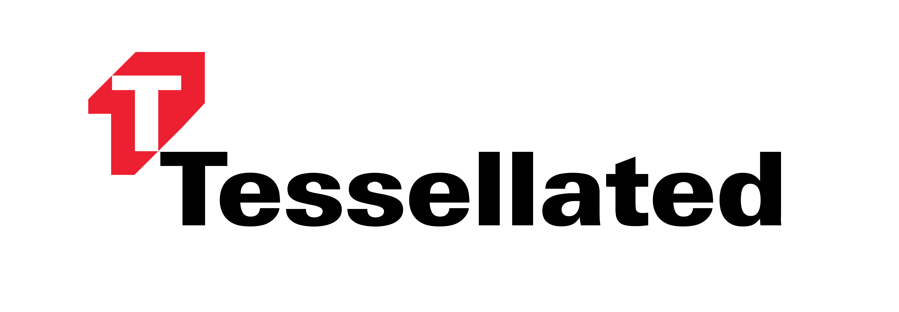

<div align="center">
<p style="font-size:24px; font-weight: bold;">Planetarium</p>
<p>
      
<small>Software by <a href="https://tessellated.io" target="_blank"> Tessellated // tessellated.io</a></small>
</p>
</div>

---
Planetarium is a small server for the [Cosmos Chain Registry](https://github.com/cosmos/chain-registry) and [EcoStake Validator Registry](https://github.com/eco-stake/validator-registry).

Planetarium is aimed to be simple, easy to deploy, and manage updates. Tessellated provides a hosted implementation of this API, which you can find at [planetarium.tessellated.io](https://planetarium.tessellated.io).

## API 

Planetarium has two namespaces:
- `/v1/chains`: For information from the chain registry
- `/v1/validators`: For information from the validator registry

In most cases, the existing file structure of the validator and chain registry are provided as-is. For instance, to find [`cosmoshub/chain.json`](https://github.com/cosmos/chain-registry/blob/0995e7859e47136a7cb98d97c0e93739f268b091/cosmoshub/chain.json) you would simply `curl planetarium.tessellated.io/v1/chains/cosmoshub/chain.json`. Likewise, to find [`tessellated/profile.json`](https://github.com/eco-stake/validator-registry/blob/e1a994fdd93af96d021fe14bd52815c2adb793cf/tessellated/profile.json) from the validator registry: ``curl planetarium.tessellated.io/v1/validators/tessellated/profile.json``.

These additional routes are provided for convenience:
- **`/v1/chains/all`**: List all chains

## Installing

It's easy to install or self host Planetarium. 

### Get Planetarium

```shell
$ git clone https://github.com/tessellated-io/planetarium # (Use --recursive if you want to pull chain-registry and validator-registry which are defined as submodules).
$ make install
 
$ planetarium --help
```

### Set Up Registry Data

Rather than provide an opaque or configurable update strategy, Planetarium simply pulls static data from your disk and hosts it. At runtime, you specify the directories, and thus can configure it to update however you want (manually, via a cron job, etc).

> **NOTE:** A side effect is that anything inside of your chain and validator registry folders is hosted. Be sure to not inadvertently expose sensitive data. 

You'll need to clone the Chain and Validator registry:
```shell
$ git clone https://github.com/cosmos/chain-registry /home/user/chain-registry
$ git clone https://github.com/eco-stake/validator-registry /home/user/validator-registry 
```

### Run Planetarium

```shell
$ planetarium start --port 8080 --chain-registry-path /home/user/chain-registry --validator-registry /home/user/validator-registry
```

### Updating Registry Data

Simply git pull any updates, though you will likely want to run this on a cron job or similar

```shell
$ cd /home/user/chain-registry && git pull
$ cd /home/user/validator-registry && git pull
```

